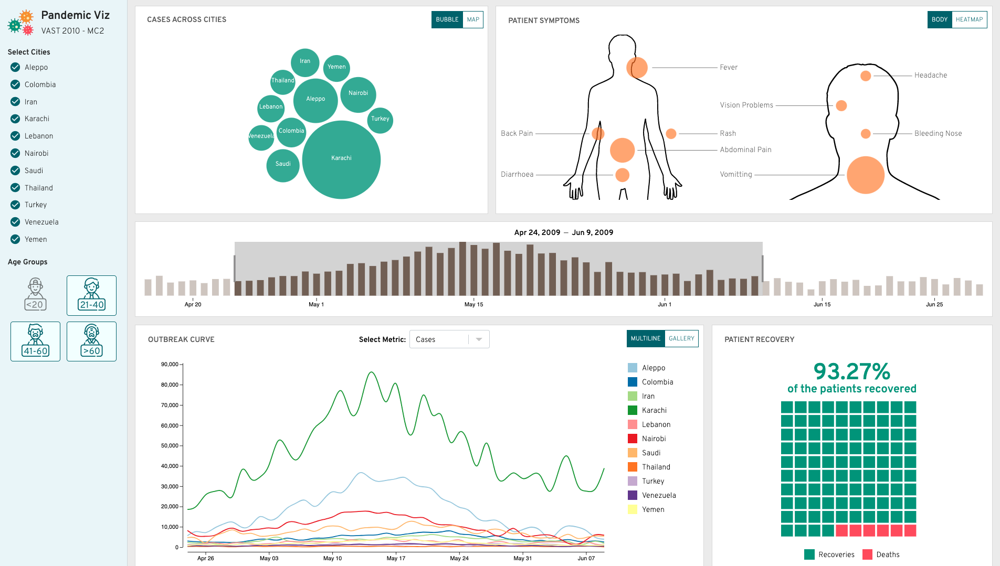

# Pandemic Viz

**Live Demo** - [https://pandemic-dashboard-cse-578.netlify.app/](https://pandemic-dashboard-cse-578.netlify.app/)



This repo contains dashboard code and data preprocessing for **VAST Mini Challenge 2010 - MC2**

* [dashboard](`dashboard`) - Frontend code
* [scripts](`scripts`) - Python scripts for data preprocessing

## Dashboard Setup

**Prerequisites**

* [NodeJS 14.x](https://nodejs.org/en/)

**Step 1 - Go to the `dashboard` folder**

```
cd dashboard
```

**Step 2 - Install dependencies**

```
npm install
```

or 

```
yarn install
```

**Step 3 - Run the development server**

```
npm run start
```

or

```
yarn start
```

**Step 4 - Open the dashboard in browser**

By default, the dashboard will be open on 3000 port - [localhost:3000](http://localhost:3000/)