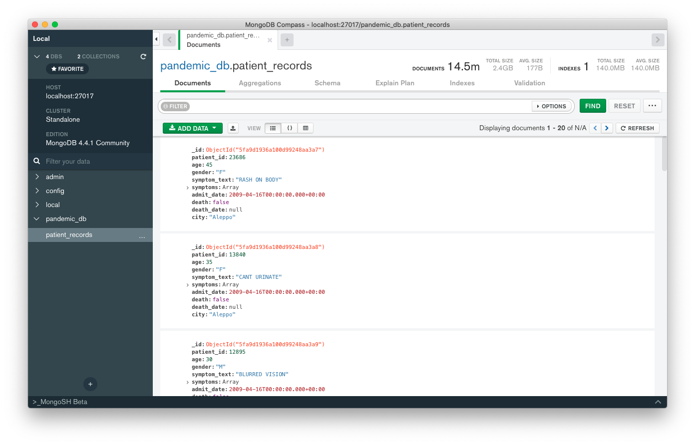

# Data Preprocessing

**Install Python Dependencies**

```
pip install -r requirements.txt
```

## 1. Mongo Dumping

**Prerequisites**

* Download and extract [VAST 2010 MC2 Dataset](https://www.cs.umd.edu/hcil/varepository/VAST%20Challenge%202010/challenges/MC2%20-%20Characterization%20of%20Pandemic%20Spread/dataset/VAST2010-Mini-2-Data%20Files-v2-04-03.zip)
* Install MongoDB
* Create a database `pandemic_db`
* Create an empty collection `patient_records` inside `pandemic_db`

This step will process the records from the dataset and dump all patient information to MongoDB.

**Running Script**

You need to give 3 arguments to the `mongo_dump.py` script.

1. `vast_path` - Absolute path to the dataset folder `VAST2010-Mini-2-Data Files-v2-04-03`
2. `symptom_map` - Absolute path to the `scripts/symptom_mappings/mapping.json` file present inside this repo.
3. `mongo_conn_str` - MongoDB Connection String. (Refer [Connection String URI Format](https://docs.mongodb.com/manual/reference/connection-string/))
   - `mongodb://localhost:27017`
   - `mongodb://username@password:localhost:27017`

```
python mongo_dump.py \ 
    --vast_path "/path/to/VAST2010-Mini-2-Data Files-v2-04-03" \
    --symptom_map "/path/to/pandemic-dashboard/scripts/symptom_mappings/mapping.json" \
    --mongo_conn_str "mongodb://localhost:27017"
```

This script will take ~10 minutes to run. At the end, you should have about 5.9M documents inside MongoDB collection `patient_records`. This will take **~1.1GB** of disk space.

You can use [MongoDB Compass](https://www.mongodb.com/products/compass) to explore the records.



## 2. Timeline Data

> Note: You should run previous step before this.

You need to give 1 argument to the `timeline_data.py` script.

1. `mongo_conn_str` - MongoDB Connection String.

```
python timeline_data.py --mongo_conn_str "mongodb://localhost:27017"
```

This script will generate `scripts/data/timeline.json` file.